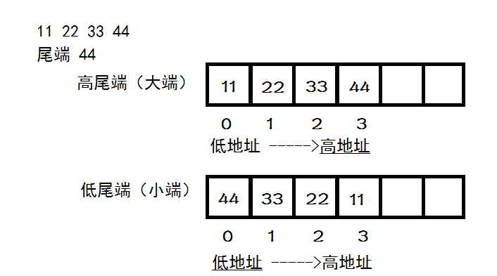

## http get和post区别  
+ 有关 GET 请求的其他一些注释：
    GET 请求可被缓存
    GET 请求保留在浏览器历史记录中
    GET 请求可被收藏为书签
    GET 请求不应在处理敏感数据时使用
    GET 请求有长度限制
    GET 请求只应当用于取回数据
    编码类型：application/x-www-form-urlencoded
> 

+ 有关 POST 请求的其他一些注释：
    POST 请求不会被缓存
    POST 请求不会保留在浏览器历史记录中
    POST 不能被收藏为书签
    POST 请求对数据长度没有要求
    编码类型：application/x-www-form-urlencoded 或 multipart/form-data。为二进制数据使用多重编码。

>  

[HTTP 方法：GET 对比 POST](http://www.w3school.com.cn/tags/html_ref_httpmethods.asp)

******

## http和https的区别

**http**：是互联网上应用最为广泛的一种网络协议，是一个客户端和服务器端请求和应答的标准（TCP），**用于从web服务器传输超文本到本地浏览器的传输协议**，它可以使浏览器更加高效，使网络传输减少。
**https**：是以安全为目标的HTTP通道，简单讲是HTTP的安全版，**即HTTP下加入SSL层，HTTPS的安全基础是SSL，因此加密的详细内容就需要SSL**。HTTPS协议的主要作用可以分为两种：**一种是建立一个信息安全通道，来保证数据传输的安全；另一种就是确认网站的安全真实性**

+ #### Https优点  
1. 使用HTTPS协议可认证用户和服务器，确保数据发送到正确的客户机和服务器；
2. HTTPS协议是由SSL+HTTP协议构建的可进行加密传输、身份认证的网络协议，要比http协议安全，可防止数据在传输过程中不被窃取、改变，确保数据的完整性。
3. HTTPS是现行架构下最安全的解决方案，虽然不是绝对安全，但它大幅增加了中间人攻击的成本。

+ #### Https缺点  
1. HTTPS协议握手阶段比较费时，会使页面的加载时间延长近50%，增加10%到20%的耗电；
2. HTTPS连接缓存不如HTTP高效，会增加数据开销和功耗，甚至已有的安全措施也会因此而受到影响；
3. SSL证书需要钱，功能越强大的证书费用越高，个人网站、小网站没有必要一般不会用。  

+ #### SSL
    + **概念**：SSL证书通过在客户端浏览器和Web服务器之间建立一条SSL安全通道（Secure socket layer(SSL)安全协议是由Netscape Communication公司设计开发。SSL 证书就是遵守 SSL协议，由受信任的数字证书颁发机构CA，在验证服务器身份后颁发，具有服务器身份验证和数据传输加密功能。
    + **原理**： 安全套接字层(SSL) 技术通过加密信息和提供鉴权，保护您的网站安全。**一份SSL证书包括一个公共密钥和一个私用密钥。公共密钥用于加密信息，私用密钥用于解译加密的信息**。浏览器指向一个安全域时，SSL 同步确认服务器和客户端，并创建一种加密方式和一个唯一的会话密钥。它们可以启动一个保证消息的隐私性和完整性的安全会话
    + **包含协议**：握手协议（Handshake protocol）、记录协议（Record protocol）、警报协议（Alert protocol）

[HTTP与HTTPS的区别](https://www.cnblogs.com/wqhwe/p/5407468.html)
[SSL证书](https://baike.baidu.com/item/SSL证书/5201468?fr=aladdin)

******

## URl访问的网络传输过程

整个过程基本分做下面几个部分：

1. 域名解析成IP地址；
2. 与目的主机进行TCP连接（三次握手）；
3. 发送与收取数据；
4. 与目的主机断开TCP连接（四次挥手）；

*DNS域名解析示意图：* 

[DNS域名解析原理](https://blog.csdn.net/qq_36031499/article/details/54138832)  

******

## tcp三次握手和四次挥手

[TCP的三次握手与四次挥手](https://blog.csdn.net/qzcsu/article/details/72861891)

******

## tcp怎么保证消息可靠和有序  
1. 将数据截断为合理的长度
2. 超时重发
3. 对于收到的请求，给出确认响应,会有一些推迟，之所以推迟，可能是要对包做完整校验
4. 校验出包有错，丢弃报文段，不给出响应，TCP发送数据端，超时时会重发数据
5. 对失序数据进行重新排序，然后才交给应用层
6. 既然IP数据报会发生重复，TCP的接收端必须丢弃重复的数据。(对于重复数据，能够丢弃重复数据)
7. TCP可以进行流量控制，防止较快主机致使较慢主机的缓冲区溢出，TCP使用的流量控制协议是可变大小的滑动窗口协议。

**字节流服务**
 两个应用程序通过TCP连接交换8bit字节构成的字节流。TCP不在字节流中插入记录标识符。我们将这称为**字节流服务（bytestreamservice）**。TCP对字节流的内容不作任何解释。TCP不知道传输的数据字节流是二进制数据，还是ASCII字符、EBCDIC字符或者其他类型数据。**对字节流的解释由TCP连接双方的应用层解释**。

>  
TCP协议保证数据传输可靠性的方式主要有：
+ 校验和
+ 序列号
+ 确认应答
+ 超时重传
+ 连接管理
+ 流量控制
+ 拥塞控制

[网络基础：TCP协议-如何保证传输可靠性](https://blog.csdn.net/liuchenxia8/article/details/80428157)

******

## tcp和udp

+ ***优缺点***
**TCP的优点**：可靠，稳定 TCP的可靠体现在TCP在传递数据之前，会有三次握手来建立连接，而且在数据传递时，有确认、窗口、重传、拥塞控制机制，在数据传完后，还会断开连接用来节约系统资源。 
**TCP的缺点**：慢，效率低，占用系统资源高，易被攻击 TCP在传递数据之前，要先建连接，这会消耗时间，而且在数据传递时，确认机制、重传机制、拥塞控制机制等都会消耗大量的时间，而且要在每台设备上维护所有的传输连接，事实上，每个连接都会占用系统的CPU、内存等硬件资源。 而且，因为TCP有确认机制、三次握手机制，这些也导致TCP容易被人利用，实现DOS、DDOS、CC等攻击。

**UDP的优点**：快，比TCP稍安全 UDP没有TCP的握手、确认、窗口、重传、拥塞控制等机制，UDP是一个无状态的传输协议，所以它在传递数据时非常快。没有TCP的这些机制，UDP较TCP被攻击者利用的漏洞就要少一些。但UDP也是无法避免攻击的，比如：UDP Flood攻击…… 
**UDP的缺点**：不可靠，不稳定 因为UDP没有TCP那些可靠的机制，在数据传递时，如果网络质量不好，就会很容易丢包。

+ ***应用场景***
**什么时候应该使用TCP**：当对网络通讯质量有要求的时候，比如：整个数据要准确无误的传递给对方，这往往用于一些要求可靠的应用，比如HTTP、HTTPS、FTP等传输文件的协议，POP、SMTP等邮件传输的协议。 在日常生活中，常见使用TCP协议的应用如下：浏览器，用的HTTP FlashFXP，用的FTP Outlook，用的POP、SMTP Putty，用的Telnet、SSH QQ文件传输
**什么时候应该使用UDP**：当对网络通讯质量要求不高的时候，要求网络通讯速度能尽量的快，这时就可以使用UDP。 比如，日常生活中，常见使用UDP协议的应用如下：QQ语音 QQ视频

[TCP和UDP的区别和优缺点](https://blog.csdn.net/xiaobangkuaipao/article/details/76793702)
******

## 大端小端  
  

通俗的讲就是
大端：大数据在后小数据在前
小端：小数据在前大数据在后  

[详解大端模式和小端模式](https://www.cnblogs.com/little-white/p/3236548.html)

******  

## RPC（Remote Procedure Call）—远程过程调用

[RPC服务和HTTP服务对比](https://blog.csdn.net/wangyunpeng0319/article/details/78651998)
******